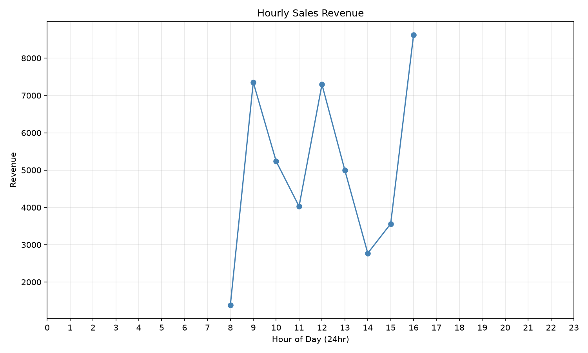
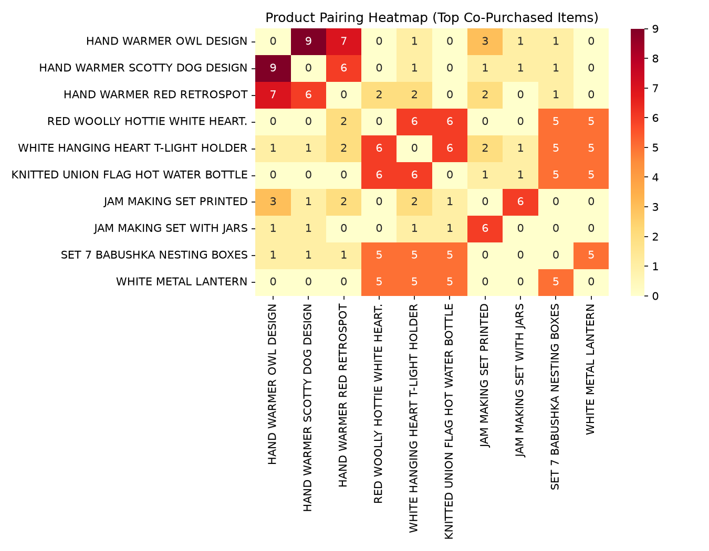
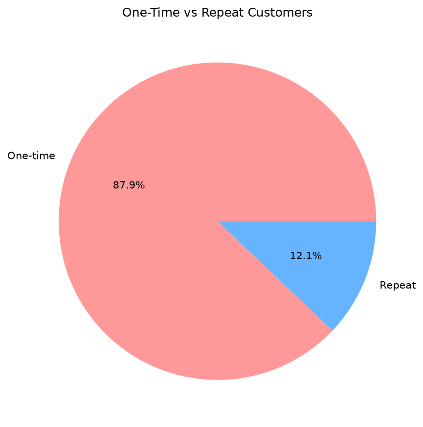
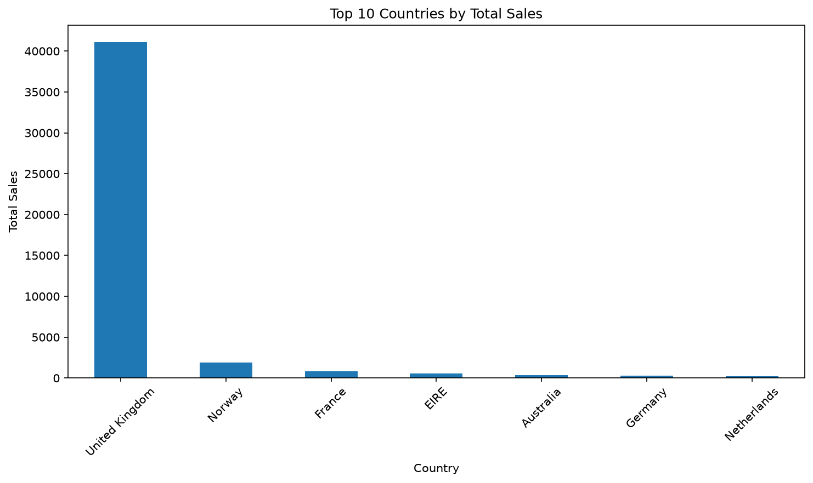

# 🛒 24-Hour E-Commerce Flash Sale Performance Analysis
An end-to-end data analytics project examining transactional data from a single-day 24-hour flash sale promotion. This project combines **MySQL** for data cleaning and pipeline aggregation with **Python (Pandas, Seaborn)** for exploratory data analysis, intraday customer segmentation, and market basket co-occurrence modeling.

## Tools Used
- **PostgreSQL / pgAdmin 4** — data cleaning, EDA, advanced SQL (CTEs, window functions)
- **Python (pandas, matplotlib)** — data visualization
- **Jupyter Notebook / VS Code**

## About the Dataset
All transactions in this dataset occurred within a single calendar day (Dec 1, 2010, roughly 8:26am–5:06pm). This ruled out traditional time-series analysis (monthly/daily trends, day-of-week patterns, cohort retention) — instead, the analysis is built around **intraday** patterns: what happened hour-by-hour during the sale, and how quickly different customers acted.

## Project Structure

sql/
00_setup_raw_table.sql
01_data_cleaning_and_staging.sql
02_intraday_sales_velocity.sql
03_advanced_analytics.sql
sales_viz.ipynb
images/

## Project Workflow

### 1. Data Cleaning (SQL)
- Loaded raw transaction data into an `ecommerce` staging table
- Cleaned it into a `sales_clean` table by removing duplicates, records with missing Customer IDs, and cancelled invoices
- Computed a `line_total` column (Quantity × UnitPrice) used throughout the rest of the analysis
- Final cleaned dataset: 1,800 transactions

### 2. Sales Velocity Analysis (SQL)
Since every transaction happened on the same date, the meaningful time dimension here is **hour of day**, not day or month:
- **Hourly revenue, order count, and average order value (AOV)** — reveals how sales built up and tapered off over the course of the sale
- **Peak order-volume hour vs. peak AOV hour** — these turned out to be different hours (12pm had the most orders; 4pm had the highest average order value), meaning the busiest hour isn't necessarily the most profitable one
- **Top-10 products by revenue during the sale**

### 3. Advanced Analytics (SQL)
- **Intraday RFM segmentation** — customers scored on Recency, Frequency, and Monetary value (via `NTILE(4)` quartiles) and grouped into segments: Champions (10), Loyal Customers (23), At-Risk (9), Lost (49). Since the dataset spans a single day, "Recency" here reflects how early or late a customer's activity fell within the sale window, rather than days since purchase.
- **Market basket analysis** — a self-join on `InvoiceNo`/`StockCode` to find which products were most frequently bought together in the same order. Surfaced two clusters: a hand-warmer design family (Owl, Scotty Dog, Red Retrospot, Polka Dot, Union Jack) and a home-decor hub product (Glass Star Frosted T-Light Holder, paired with 5 other decor items).
- **Additional EDA** — three supporting queries: a Pareto (80/20) analysis testing whether ~20% of products drive ~80% of revenue, an average-order-quantity check per customer to flag likely wholesale vs. retail buyers, and an order-size distribution using `NTILE(4)` to bucket orders into spending quartiles.

### 4. Visualization & Insights (Python)

## Visualizations

### Hourly Sales Revenue

Revenue tracked across each hour of the sale, showing how activity built up and peaked rather than staying flat — the pattern a monthly chart would have completely hidden on single-day data.

### Product Pairing Heatmap

Cross-sell relationships between the top co-purchased products. The clearest pattern is a tightly-paired hand-warmer product cluster (Owl, Scotty Dog, Red Retrospot designs) — a strong bundling candidate for future sales.

### Customer Segmentation: One-Time vs. Repeat

~85% of customers made only one purchase, but the remaining ~15% (repeat customers) account for ~35% of total revenue.
**Insight:** Repeat customers are ~2.3x more valuable per head than average, but the larger growth opportunity lies in converting first-time buyers into repeat customers, rather than deepening incentives for an already-loyal minority.

### Sales by Country

United Kingdom accounts for the vast majority of sales (~90%); Norway is the next-largest market.

## Key Takeaways
- Sales activity is concentrated around specific hours rather than spread evenly — the busiest hour (most orders, 12pm) isn't the same as the most profitable hour (highest AOV, 4pm), which has direct implications for staffing and promotion timing in a flash-sale format.
- A small, loyal customer segment (15%) disproportionately drives revenue (35%) — supporting a customer-conversion strategy over pure discounting.
- A clear product-bundling opportunity exists around the hand-warmer product line, based on consistent co-purchase patterns.
- Sales are heavily concentrated in a single market (UK), suggesting untapped opportunity in secondary markets like Norway.

